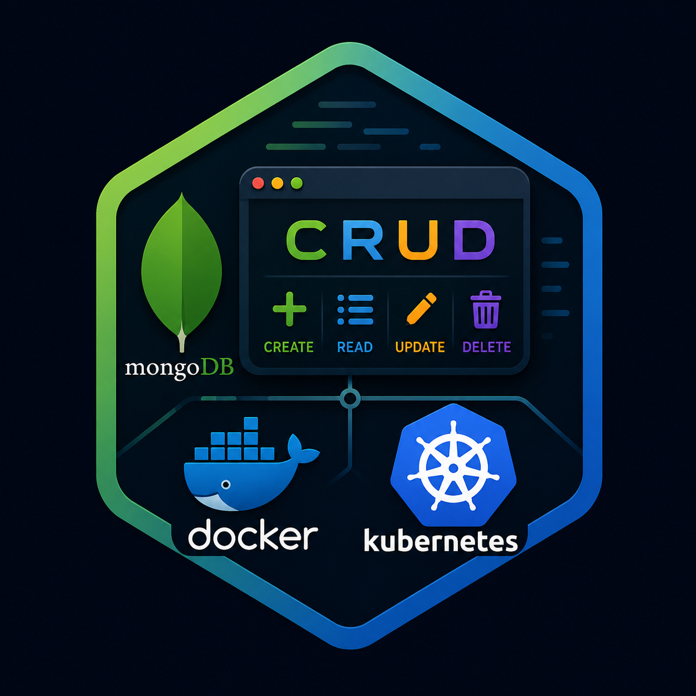
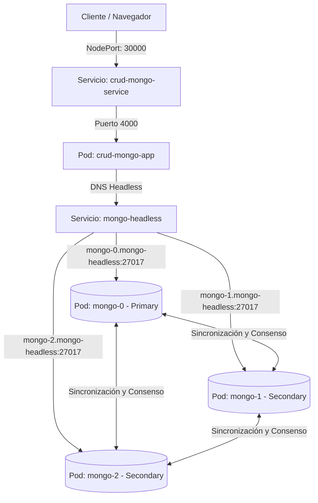

<p align="center">
  
</p>

<h1 align="center">CRUD con MongoDB Replica Set en Kubernetes</h1>

<p align="center">
  Entorno robusto, cloud-native y de alta disponibilidad desarrollado con MongoDB (Replica Set), Kubernetes (K8s), Docker y Node.js.
</p>

<p align="center">
  
  
  
  
</p>

---

## Introducción

Este repositorio aloja una solución orientada a la gestión de usuarios bajo un enfoque de **Sistemas Distribuidos** de alto nivel. Hemos migrado la infraestructura monolítica inicial hacia una arquitectura moderna y tolerante a fallos, implementando un clúster distribuido de **MongoDB Replica Set** orquestado en **Kubernetes**. 

El proyecto demuestra empíricamente el comportamiento del consenso, auto-recuperación y failover de bases de datos en caliente, garantizando disponibilidad absoluta del servicio web CRUD incluso ante la pérdida de servidores físicos de datos.

> La alta disponibilidad no es una característica opcional; es la base de cualquier sistema moderno en producción.

---

## El Desafío y la Solución Cloud-Native

### El Desafío
En entornos tradicionales con un solo nodo, la caída física del servidor interrumpe el servicio por completo, provocando pérdida de datos y caídas prolongadas mientras el administrador interviene manualmente.

### La Respuesta (Kubernetes + Replica Set)
Este proyecto implementa una arquitectura automatizada de replicación activa distribuida en Kubernetes mediante:
- **StatefulSet**: Controla 3 réplicas idénticas de MongoDB (`mongo-0`, `mongo-1`, `mongo-2`) manteniendo identidades de red y persistencia inmutables.
- **Persistent Volume Claims (PVCs)**: Discos de almacenamiento dedicados a cada nodo que sobreviven a la destrucción y recreación de contenedores (Self-Healing).
- **Headless Service**: Otorga direcciones DNS estables a nivel de clúster (`mongo-X.mongo-headless`) requeridas por el Replica Set para comunicarse.
- **Job de Auto-Inicialización**: Un Job automatizado que se ejecuta una sola vez para configurar el Replica Set sin intervención humana.

---

## Arquitectura del Entorno (Kubernetes)

El tráfico de red y la topología distribuidos dentro del clúster de Kubernetes se estructuran de la siguiente manera:



---

## Estructura del Repositorio

```text
├── k8s/                           # Manifiestos de Kubernetes
│   ├── app-configmap.yaml         # Variables de entorno descentralizadas
│   ├── app-deployment.yaml        # Despliegue de la API Node.js
│   ├── app-service.yaml           # Exposición externa mediante NodePort (30000)
│   ├── mongo-headless-service.yaml# DNS estables para el Replica Set
│   ├── mongo-statefulset.yaml     # 3 Réplicas Mongo con almacenamiento persistente (PVC)
│   └── mongo-init-job.yaml        # Inicializador automático del clúster
├── Dockerfile                     # Construcción inmutable multi-stage para Node.js
├── docker-compose.yml             # Resguardo securizado local (Entorno Docker clásico)
├── server.js                      # API con lógica de reconexión activa y validaciones BSON
└── index.html                     # Frontend interactivo para consumo del CRUD
```

---

## Despliegue en Kubernetes (Minikube)

Sigue estos sencillos pasos para iniciar y probar la arquitectura en tu clúster local:

```bash
# 1. Iniciar el clúster de Minikube (Driver Docker recomendado en Windows)
minikube start

# 2. Compilar la aplicación Node.js de forma inmutable
docker build -t crud-mongo-app:latest .

# 3. Cargar la imagen directamente en la memoria de Minikube
minikube image load crud-mongo-app:latest

# 4. Desplegar toda la infraestructura en Kubernetes
kubectl apply -f k8s/
```

### Verificación de Pods en Ejecución
Puedes monitorear el encendido secuencial de tus pods ejecutando:
```bash
kubectl get pods -w
```
*Espera a que los pods de mongo (0, 1, 2) estén en estado `Running` y el pod `mongo-init-job` en estado `Completed`.*

### Acceso a la Aplicación Web
Para interactuar con el CRUD, solicita el túnel de red de Minikube:
```bash
minikube service crud-mongo-service --url
```
Copia y pega la dirección devuelta en tu navegador (ej: `http://127.0.0.1:64567`) para comenzar a registrar usuarios.

---

## Auditoría y Pruebas de Resiliencia

### 1. Consultar los Roles del Replica Set en Tiempo Real
Puedes validar de forma instantánea qué nodo ha sido elegido como primario y el estado de los secundarios ejecutando:
```bash
kubectl exec mongo-0 -- mongosh --quiet --eval "rs.status().members.forEach(m => print(m.name + ' -> ' + m.stateStr))"
```

### 2. Prueba de Tolerancia a Fallos (Self-Healing)
Mientras tienes la aplicación abierta, elimina forzosamente el pod líder del clúster:
```bash
kubectl delete pod mongo-0
```
Verás que Kubernetes levanta un nuevo pod de inmediato. Si actualizas tu navegador, **los datos se mantendrán intactos** gracias al desacoplamiento de discos (`PVC`), y la API seguirá respondiendo tras un rápido traspaso de roles de líder.

### 3. Prueba de Fuego Avanzada (Congelamiento de Red/CPU)
Envía una señal de suspensión al proceso de base de datos del líder para simular un bloqueo de red en caliente:
```bash
# Pausar temporalmente el proceso de MongoDB en el líder
kubectl exec mongo-0 -- kill -STOP 1
```
El clúster detectará el congelamiento y elegirá a un nuevo líder de inmediato en menos de 5 segundos. Posteriormente, descongela al nodo dañado para ver cómo se reincorpora al clúster como secundario de soporte:
```bash
kubectl exec mongo-0 -- kill -CONT 1
```

---

## Roadmap del Proyecto

### ✅ Fase 1: Estabilización (Completado)
* [x] Remover dependencias en la nube (MongoDB Atlas).
* [x] Unificar todo el entorno de almacenamiento y ejecución localmente.
* [x] Blindaje de la API con validación estricta de BSON (`ObjectId.isValid`) y control de reconexión.

### ✅ Fase 2: Kubernetes y Cloud Native (Completado)
* [x] Creación de manifiestos Yaml de Kubernetes.
* [x] Implementación de **StatefulSets** y **PVCs** para MongoDB.
* [x] Configuración de **Headless Services** para enrutamiento DNS del Replica Set.
* [x] Despliegue de API y exposición segura mediante **NodePort (30000)**.
* [x] Automatización de inicialización del Replica Set mediante un Job de K8s.

### 🚀 Fase 3: Hardening y Seguridad (Siguientes Pasos)
* [ ] Implementación de autenticación Keyfile para la comunicación interna del Replica Set.
* [ ] Encriptación de secrets de base de datos en Kubernetes.

---

## Licencia

Este proyecto se distribuye bajo la Licencia MIT.
