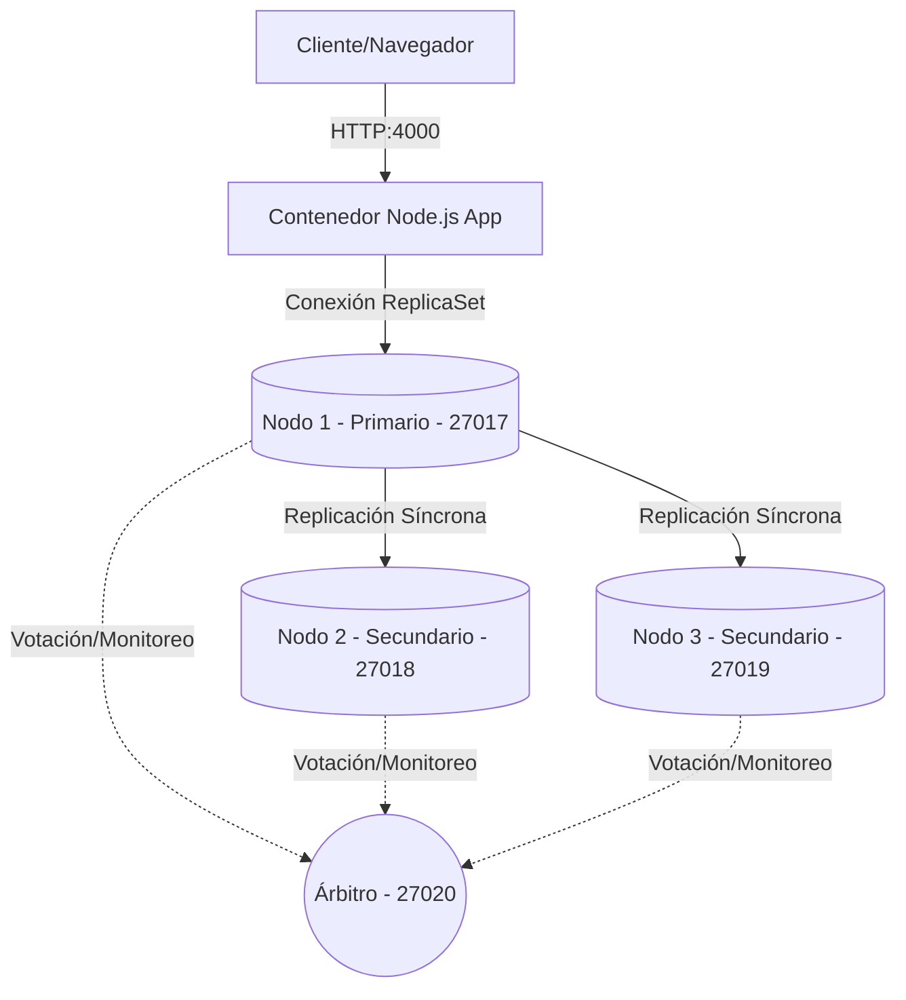

<p align="center">
  
</p>

<h1 align="center">CRUD con MongoDB Replica Set</h1>

<p align="center">
  Entorno robusto y de alta disponibilidad desarrollado con MongoDB (Replica Set), Docker Compose y Node.js.
</p>

<p align="center">
  
  
  
  
</p>

---

## Introduccion

Este repositorio aloja una solucion practica orientada a la gestion de usuarios, implementando una arquitectura tolerante a fallos mediante un clúster local de MongoDB. El proyecto demuestra de forma empirica el comportamiento de un **Replica Set** (RS) en entornos contenerizados, asegurando que las operaciones CRUD nunca se interrumpan, incluso ante la caida critica de nodos de base de datos.

> La alta disponibilidad no es una caracteristica opcional; es la base de cualquier sistema moderno en producción.

---

## El Problema y la Solucion

### El Desafio
En entornos de base de datos tradicionales con un solo nodo, cualquier caida del servidor de base de datos interrumpe el servicio por completo, provocando perdida de datos en transito o downtime prolongado mientras el administrador del sistema interviene manualmente.

### La Respuesta
Este proyecto implementa una arquitectura automatizada de replicacion activa con un clúster de MongoDB compuesto por:
- **Un nodo primario** que recibe escrituras y lecturas de forma predeterminada.
- **Dos nodos secundarios** que replican constantemente el dataset y pueden asumir el rol de lider en cuestion de milisegundos.
- **Un nodo arbitro** que actua exclusivamente como juez en elecciones en caso de falla.

Todo el ecosistema se levanta y configura automaticamente con un solo comando, abstrayendo la complejidad de red e inicializacion.

---

## Caracteristicas Principales

- **Tolerancia a fallos automatizada**: Failover transparente y transparente para la aplicacion sin necesidad de reconfigurar parametros de conexion.
- **Liderazgo preferencial**: Nodo lider preferente configurado por prioridad para centralizar el tráfico primario bajo condiciones ideales.
- **Monitoreo integrado**: Interfaz web intuitiva que grafica en tiempo real el estado de salud de la conexion.
- **Orquestación modular**: Estructura lista para integracion en ambientes de orquestacion local de contenedores.

---

## Arquitectura del Entorno

La red interna de Docker se compone de los siguientes elementos trabajando de manera coordinada:



| Contenedor | Puerto Local | Rol en el Clúster | Descripcion |
| :--- | :--- | :--- | :--- |
| `nodo1` | `27017` | Primario (Prioridad 2) | Nodo preferente para operaciones de escritura y lectura. |
| `nodo2` | `27018` | Secundario (Prioridad 1) | Copia de respaldo activa. Elegible como primario. |
| `nodo3` | `27019` | Secundario (Prioridad 1) | Copia de respaldo activa. Elegible como primario. |
| `arb` | `27020` | Árbitro | No almacena datos. Solo vota para desempatar elecciones. |
| `crud-mongo-docker-kubernetes` | `4000` | Aplicación Web | Servidor Express que interactua con el clúster. |

---

## Requisitos Previos

Asegurate de contar con el siguiente software instalado en tu equipo de desarrollo:

- Docker Engine y Docker Compose V2
- Git (para control de versiones)

---

## Instalacion y Despliegue

Sigue estos pasos para clonar el repositorio e iniciar el entorno contenerizado de forma local:

```bash
# 1. Clonar el repositorio
git clone https://github.com/JohnSanchez0/crud-mongo-docker-kubernetes.git

# 2. Entrar al directorio
cd crud-mongo-docker-kubernetes

# 3. Levantar los contenedores en segundo plano
docker compose up -d
```

> **Nota de inicializacion**: El clúster tarda aproximadamente 10 a 15 segundos en auto-configurarse completamente la primera vez mediante el servicio automatizado `mongo-init` incluido en el archivo de orquestación.

---

## Uso y Administracion

### Acceso a la Interfaz de Usuario
Una vez levantado el entorno, abre tu navegador web e ingresa a la siguiente URL:
`http://localhost:4000`

Aqui podras registrar, editar, visualizar y eliminar usuarios, verificando al mismo tiempo el estado de salud de la base de datos de forma dinamica.

### Verificacion de Estado del Clúster (Sustentación)
Puedes consultar el estado detallado del Replica Set en cualquier momento ejecutando el shell de MongoDB directamente en cualquiera de los contenedores de base de datos activos:

```bash
# Si el Nodo 1 es el activo actual:
docker exec -it nodo1 mongosh --port 27017 --eval "rs.status()"

# Si el Nodo 1 ha sido apagado, puedes consultar al Nodo 2:
docker exec -it nodo2 mongosh --port 27018 --eval "rs.status()"
```

### Simulacion de Failover (Alta Disponibilidad)
Para comprobar la tolerancia a fallos en tiempo real:
1. Apaga el nodo primario (`nodo1`):
   ```bash
   docker stop nodo1
   ```
2. Consulta el estado de base de datos desde `nodo2` u observa la consola de la aplicacion: veras como se convoca a una eleccion automatica y se designa un nuevo nodo primario.
3. Interactua con la aplicacion web (`http://localhost:4000`). La creacion y edicion de usuarios continuaran funcionando sin perdida de informacion.

---

## Roadmap del Proyecto

<details>
  <summary>Ver plan de desarrollo a mediano y largo plazo</summary>

### Fase 1: Estabilizacion
- [x] Remover dependencias en la nube (MongoDB Atlas).
- [x] Unificar todo el entorno de almacenamiento y ejecucion localmente.
- [x] Limpieza de logs y refactorizacion de comentarios y mensajes de API.

### Fase 2: Kubernetes y Cloud Native
- [ ] Creación de manifiestos Yaml para despliegue en Kubernetes local (Minikube / k3s).
- [ ] Implementación de StatefulSets para los nodos de MongoDB.
- [ ] Configuración de Headless Services para mantener la estabilidad de red de los nodos de datos.
- [ ] Configuración del Deployment y el Service de la aplicación Node en Kubernetes.

### Fase 3: Seguridad
- [ ] Implementación de autenticación Keyfile para la comunicacion interna del Replica Set.
- [ ] Encriptación de secrets de base de datos en Kubernetes.

</details>

---

## Contribucion

Si deseas colaborar con el proyecto o proponer mejoras:
1. Haz un Fork del repositorio.
2. Crea una rama para tu feature (`git checkout -b feature/nueva-mejora`).
3. Confirma tus cambios (`git commit -m "feat: agregar nueva mejora"`).
4. Sube la rama (`git push origin feature/nueva-mejora`).
5. Abre un Pull Request describiendo detalladamente tu propuesta.

---

## Licencia

Este proyecto se distribuye bajo la Licencia MIT. Consulta el archivo `LICENSE` (si aplica) para mayor información.
